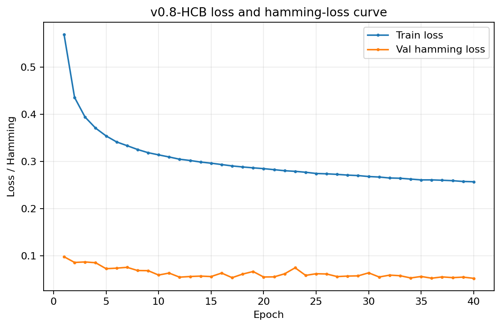
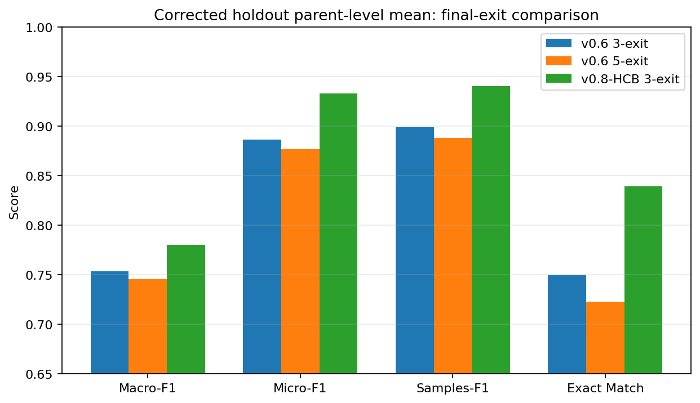
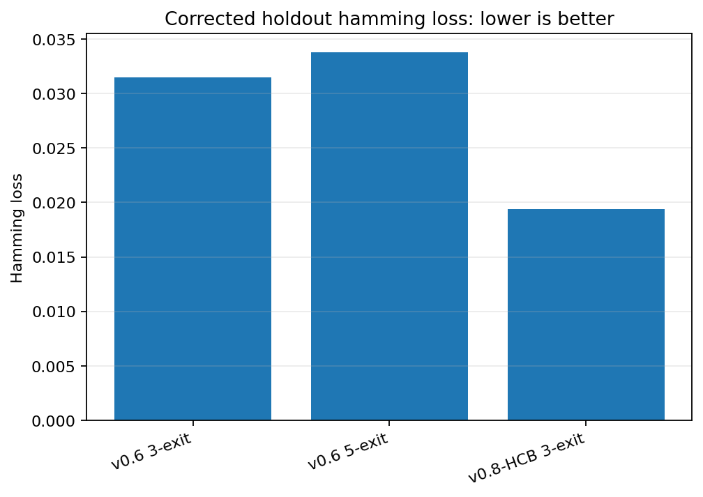
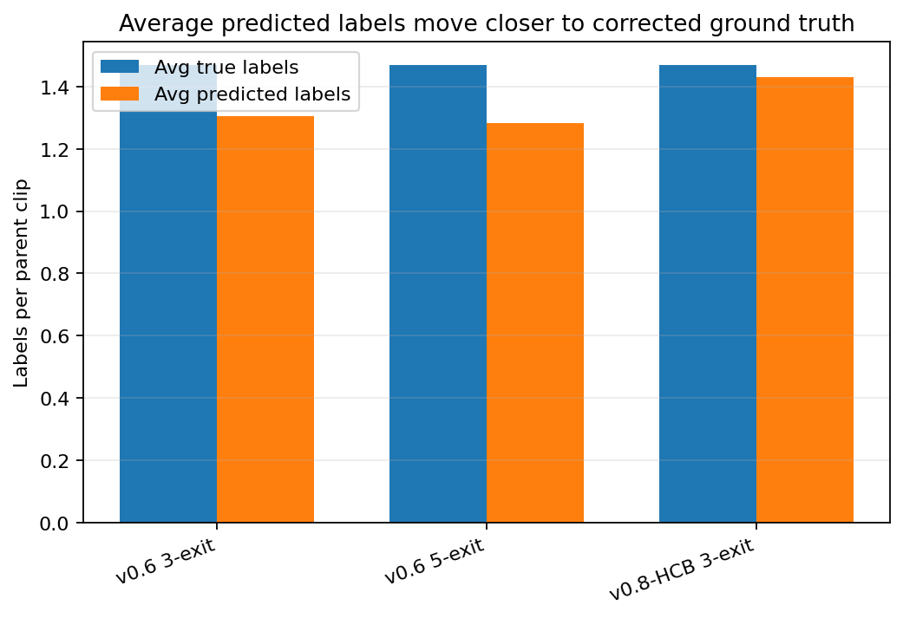
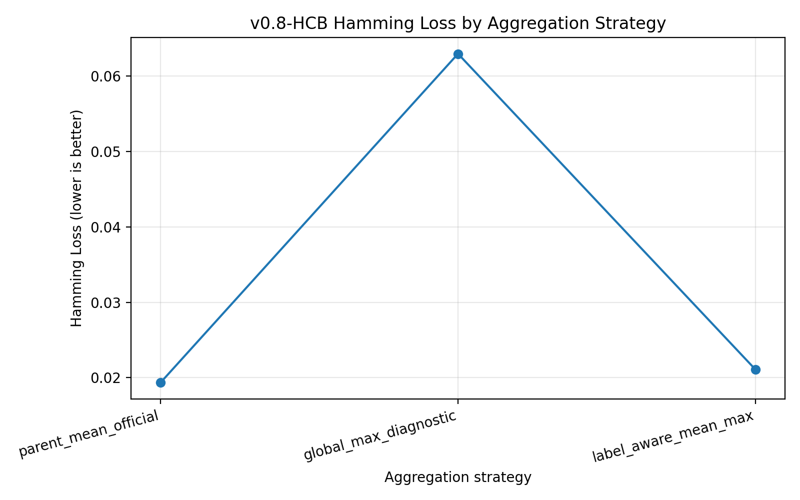
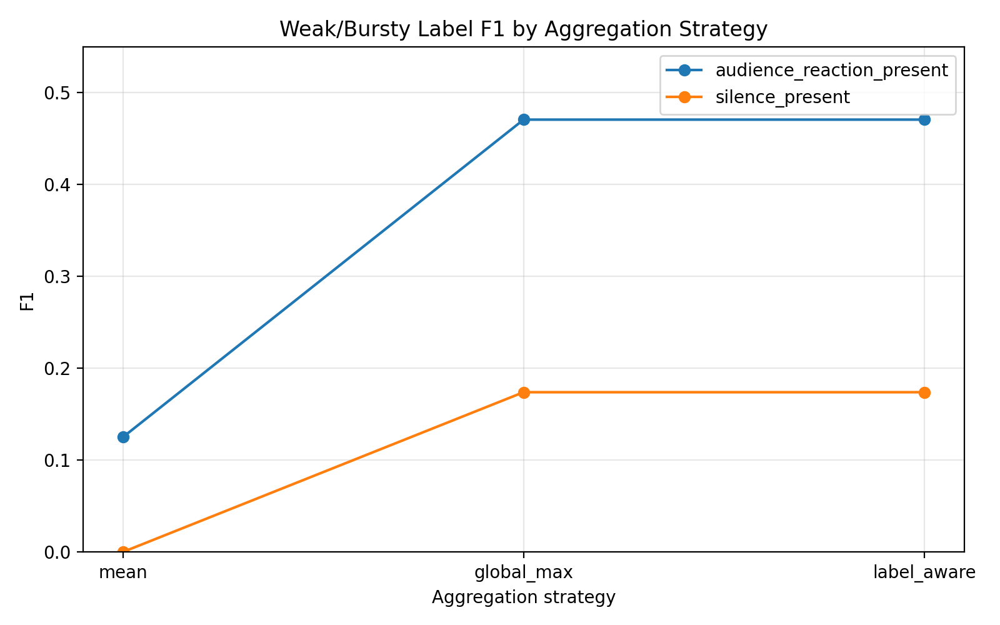
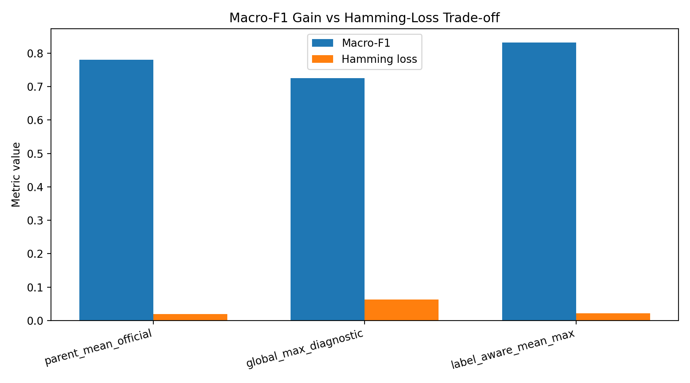
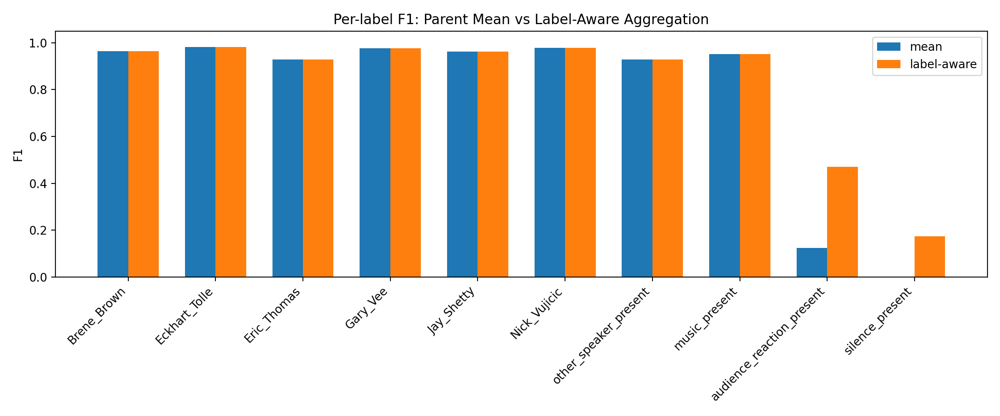
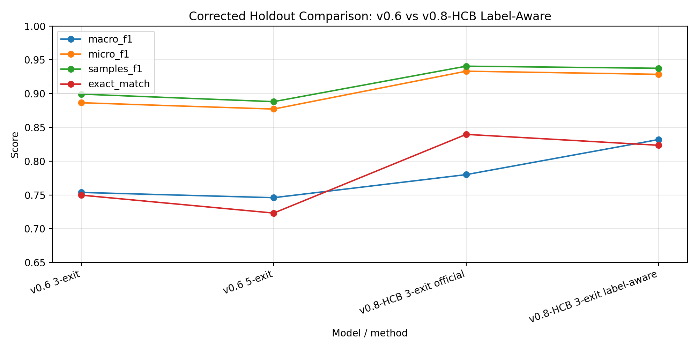

---

## Post-hoc label-aware aggregation finding

After the official v0.8-HCB corrected-holdout evaluation, an additional aggregation analysis was performed to understand the weak transient labels:

```text
audience_reaction_present
silence_present
```

The official parent-level mean result remains the main overall result:

| Method | Macro-F1 | Micro-F1 | Samples-F1 | Exact Match | Hamming Loss |
|---|---:|---:|---:|---:|---:|
| Parent mean, fixed 0.5 | 0.7801 | **0.9332** | **0.9406** | **0.8397** | **0.0194** |

However, global max aggregation showed that the weak transient labels were being diluted by mean aggregation:

| Label | Parent mean F1 | Global max F1 |
|---|---:|---:|
| `audience_reaction_present` | 0.1250 | **0.4706** |
| `silence_present` | 0.0000 | **0.1739** |

Global max was not suitable as the final method because it over-predicted labels:

| Method | Macro-F1 | Micro-F1 | Samples-F1 | Exact Match | Hamming Loss | Avg Pred Labels |
|---|---:|---:|---:|---:|---:|---:|
| Parent mean | **0.7801** | **0.9332** | **0.9406** | **0.8397** | **0.0194** | 1.4302 |
| Global max | 0.7251 | 0.8203 | 0.8423 | 0.5121 | 0.0630 | 2.0346 |

The best post-hoc compromise was label-aware aggregation:

```text
mean for 8 stable labels:
  Brene_Brown
  Eckhart_Tolle
  Eric_Thomas
  Gary_Vee
  Jay_Shetty
  Nick_Vujicic
  other_speaker_present
  music_present

max for 2 transient labels:
  audience_reaction_present
  silence_present
```

| Method | Macro-F1 | Micro-F1 | Samples-F1 | Exact Match | Hamming Loss |
|---|---:|---:|---:|---:|---:|
| Parent mean official | 0.7801 | **0.9332** | **0.9406** | **0.8397** | **0.0194** |
| Label-aware mean/max | **0.8320** | 0.9285 | 0.9375 | 0.8235 | 0.0211 |

**Interpretation:** parent mean remains the official overall result, while label-aware mean/max is an additional research finding showing that rare transient labels can be recovered without retraining.

## Updated figure locations

All v0.8 human-talk figures should be stored under:

```text
docs/figures/human_talk/agentic_data_preprocessing_v0.8/
```

Recommended v0.8 figure references:

```markdown











```

## Updated documentation map

The v0.8 human-talk documentation should use these locations:

<<<<<<< HEAD
```text
docs/reports/human_talk/V08_HUMAN_CORRECTED_BALANCED_EXPERIMENT_REPORT.md
docs/results/human_talk/V08_RESULTS_SUMMARY.md
docs/tables/agentic_data_preprocessing_v0.8/
docs/figures/human_talk/agentic_data_preprocessing_v0.8/
docs/COMMANDS_V08.md
docs/APPENDIX.md
docs/MULTILABEL_EXPERIMENT_LOG.md
```
=======
Only the reviewed safe subsets were included in this v0.8-HCB experiment. The large 2,471-row changed-label queue remains a future ablation queue and was not blindly trusted.

### Manifest and balance summary

| item                                        |   count |
|:--------------------------------------------|--------:|
| seed_segment_rows                           |   12469 |
| raw_expanded_segment_rows                   |   23780 |
| final_combined_segment_rows                 |   36249 |
| raw_parent_labels_used                      |    4756 |
| zero_active_corrected_needs_review_excluded |       0 |
| missing_parent_segment_groups               |       0 |

| label                     |   before_balance |   after_balance |
|:--------------------------|-----------------:|----------------:|
| Brene_Brown               |             2885 |            2885 |
| Eckhart_Tolle             |             3145 |            3145 |
| Eric_Thomas               |             2850 |            2850 |
| Gary_Vee                  |             3135 |            3135 |
| Jay_Shetty                |             4225 |            4225 |
| Nick_Vujicic              |             2425 |            2425 |
| other_speaker_present     |            15916 |            9030 |
| music_present             |            13045 |           11393 |
| audience_reaction_present |             5124 |            5124 |
| silence_present           |             1724 |            1724 |

Balancing reduced the heavy `other_speaker_present` dominance while preserving all target-speaker, audience, silence, and seed rows.

## Training settings

| Setting                             | Value                                                                                                                                                        |
|:------------------------------------|:-------------------------------------------------------------------------------------------------------------------------------------------------------------|
| branch                              | agentic_data_preprocessing_v0.8                                                                                                                              |
| experiment                          | v0.8-human-corrected-balanced                                                                                                                                |
| run_name                            | main_v08_human_corrected_balanced_3exit                                                                                                                      |
| manifest                            | human_talk_workspace\tata_v0.8_human_corrected_balanced_pipeline\final_expanded_training_dataset_balanced\metadata\multilabel_features_manifest_balanced.csv |
| features_root                       | .                                                                                                                                                            |
| tap_blocks                          | 1,3                                                                                                                                                          |
| epochs                              | 40                                                                                                                                                           |
| batch_size                          | 64                                                                                                                                                           |
| learning_rate                       | 0.001                                                                                                                                                        |
| threshold                           | 0.5                                                                                                                                                          |
| device                              | cpu                                                                                                                                                          |
| use_pos_weight                      | False                                                                                                                                                        |
| loss_weights                        | [0.3, 0.3, 1.0]                                                                                                                                              |
| best_epoch                          | 39                                                                                                                                                           |
| best_validation_final_exit_macro_f1 | 0.8105259060931592                                                                                                                                           |

## Internal test result

|   exit |   macro_f1 |   micro_f1 |   samples_f1 |   exact_match |   hamming_loss |   avg_true_labels |   avg_pred_labels |
|-------:|-----------:|-----------:|-------------:|--------------:|---------------:|------------------:|------------------:|
|      1 |     0.2185 |     0.358  |       0.2833 |        0.1535 |         0.1293 |            1.4493 |            0.565  |
|      2 |     0.6713 |     0.6837 |       0.6478 |        0.4472 |         0.0844 |            1.4493 |            1.2208 |
|      3 |     0.8305 |     0.8283 |       0.8285 |        0.6206 |         0.0502 |            1.4493 |            1.4737 |

## Corrected holdout result

### Fixed threshold 0.5, parent mean

| model           | threshold_mode   | aggregation   |   exit |   macro_f1 |   micro_f1 |   samples_f1 |   exact_match |   hamming_loss |   jaccard_score |   avg_true_labels |   avg_pred_labels |
|:----------------|:-----------------|:--------------|-------:|-----------:|-----------:|-------------:|--------------:|---------------:|----------------:|------------------:|------------------:|
| v0.8-HCB 3-exit | fixed_0p5        | mean          |      1 |     0.113  |     0.3166 |       0.204  |        0.0288 |         0.1275 |          0.1596 |            1.4694 |            0.3956 |
| v0.8-HCB 3-exit | fixed_0p5        | mean          |      2 |     0.6315 |     0.7739 |       0.7197 |        0.5467 |         0.0591 |          0.6752 |            1.4694 |            1.1419 |
| v0.8-HCB 3-exit | fixed_0p5        | mean          |      3 |     0.7801 |     0.9332 |       0.9406 |        0.8397 |         0.0194 |          0.9174 |            1.4694 |            1.4302 |

### Tuned thresholds, parent mean

| model           | threshold_mode   | aggregation   |   exit |   macro_f1 |   micro_f1 |   samples_f1 |   exact_match |   hamming_loss |   jaccard_score |   avg_true_labels |   avg_pred_labels |
|:----------------|:-----------------|:--------------|-------:|-----------:|-----------:|-------------:|--------------:|---------------:|----------------:|------------------:|------------------:|
| v0.8-HCB 3-exit | tuned_per_exit   | mean          |      1 |     0.3756 |     0.5239 |       0.547  |        0.1546 |         0.2146 |          0.4356 |            1.4694 |            3.0392 |
| v0.8-HCB 3-exit | tuned_per_exit   | mean          |      2 |     0.7134 |     0.8107 |       0.8328 |        0.5409 |         0.0597 |          0.7671 |            1.4694 |            1.6863 |
| v0.8-HCB 3-exit | tuned_per_exit   | mean          |      3 |     0.7487 |     0.9139 |       0.921  |        0.8143 |         0.0243 |          0.8955 |            1.4694 |            1.3576 |

Fixed 0.5 is the final recommended setting. Threshold tuning improved internal validation/test Macro-F1 slightly, but it reduced corrected-holdout parent-level Macro-F1, Micro-F1, Samples-F1, Exact Match, and Hamming Loss.

## Figures

- 

- 

- 

- 

- 

- 

- 

- 

- 

- 

- 

- 

- 

- 

- 

## Documentation map

- `docs/reports/V08_HUMAN_CORRECTED_BALANCED_EXPERIMENT_REPORT.md` — thesis-ready detailed report.
- `docs/results/V08_RESULTS_SUMMARY.md` — compact results and comparison tables.
- `docs/COMMANDS_V08.md` — full PowerShell command log and purpose.
- `docs/APPENDIX.md` — expanded methodology appendix.
- `docs/MULTILABEL_EXPERIMENT_LOG.md` — chronological experiment log.
- `docs/tables/` — CSV source tables used in the docs.
- `docs/figures/` — generated line/bar plots.

## Key conclusion

v0.8-HCB is the current strongest model and should replace the old v0.6 headline as the main ASHADIP/TATA-assisted preprocessing result. The fair corrected-holdout comparison shows that v0.8-HCB improves global reliability and produces a more realistic number of predicted labels per clip. Remaining work should focus on rare event labels, especially `audience_reaction_present` and `silence_present` on corrected holdout.
>>>>>>> 95dd741cfaaf9a26e581cf7c7b8b89789694ae3e
