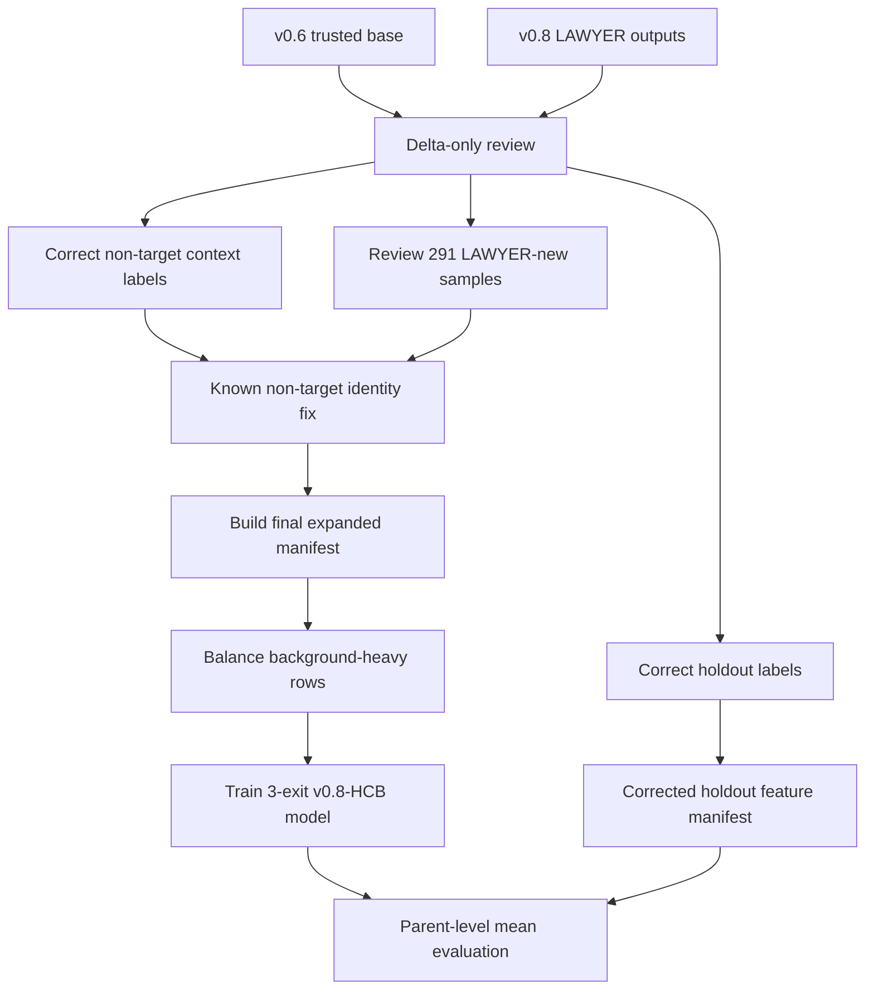

# v0.8 Human-Corrected-Balanced Experiment Report

## 1. Experiment identity

```text
Branch: agentic_data_preprocessing_v0.8
Experiment name: v0.8-human-corrected-balanced
Final run: main_v08_human_corrected_balanced_3exit_20260610_084027
Primary model: 3-exit TinyAudioCNN/ExitNet multi-label classifier
Primary evaluation: corrected holdout, parent/clip-level mean aggregation, fixed threshold 0.5
```

## 2. Research motivation

The v0.6 pipeline proved that a compact TinyAudioTriageAgent can route raw audio into accepted, warning, and needs-review groups. However, later manual inspection showed that some known non-target speaker clips were not fully reliable for context labels and that the old holdout had not fully corrected non-target background/event labels. The v0.7 filtered experiment removed known non-target source folders but did not solve rare background/event labels. v0.8 therefore focuses on label repair and data balance rather than further filtering.

The central hypothesis was:

> A trusted v0.6 base, plus targeted human correction of v0.8 LAWYER/new/non-target deltas, plus controlled background balancing, will outperform the earlier v0.6/v0.7 training manifests on a corrected raw holdout set.

## 3. Pipeline overview



## 4. Dataset and review outcomes

### 4.1 Delta review queues

| Queue                             |   Rows |
|:----------------------------------|-------:|
| v0.6 trusted base index           |   4465 |
| raw non-target context review     |   1860 |
| holdout non-target context review |    426 |
| LAWYER changed-label review queue |   2471 |
| LAWYER new-samples review queue   |    291 |
| training delta master review      |   3334 |

The final v0.8-HCB experiment did not use the full 2,471 changed-label queue. It used the reviewed non-target context labels, corrected holdout context labels, and the 291 reviewed LAWYER-new samples.

### 4.2 Corrected files created

| File/output                       |   Rows |
|:----------------------------------|-------:|
| corrected raw hybrid needs-review |   3171 |
| corrected holdout ground truth    |    867 |
| reviewed LAWYER-new samples       |    291 |
| warning plus reviewed LAWYER-new  |   1216 |

### 4.3 Final expanded manifest

| Item                                |   Count |
|:------------------------------------|--------:|
| seed reviewed segments              |   12469 |
| raw expanded segments               |   23780 |
| final combined segment rows         |   36249 |
| raw parent labels used              |    4756 |
| zero-active corrected rows excluded |       0 |
| missing parent segment groups       |       0 |

Training-group composition before balancing:

| group                             |   rows |
|:----------------------------------|-------:|
| raw_hybrid_needs_review_corrected |  15855 |
| seed_reviewed                     |  12469 |
| raw_hybrid_accepted_with_warning  |   6080 |
| raw_hybrid_accepted               |   1845 |

## 5. Balancing strategy

The unbalanced manifest had strong dominance from `other_speaker_present` and `music_present`. v0.8-HCB therefore down-sampled unprotected background-heavy rows only. Protected rows were always kept if they contained any target-speaker label, `audience_reaction_present`, `silence_present`, or clean seed data.

| Item                       |   Count |
|:---------------------------|--------:|
| input rows                 |   36249 |
| protected rows kept        |   25129 |
| eligible heavy rows before |   11120 |
| eligible heavy rows kept   |    4234 |
| dropped rows               |    6886 |
| balanced rows              |   29363 |

Label counts before/after balancing:

| label                     |   before_balance |   after_balance |
|:--------------------------|-----------------:|----------------:|
| Brene_Brown               |             2885 |            2885 |
| Eckhart_Tolle             |             3145 |            3145 |
| Eric_Thomas               |             2850 |            2850 |
| Gary_Vee                  |             3135 |            3135 |
| Jay_Shetty                |             4225 |            4225 |
| Nick_Vujicic              |             2425 |            2425 |
| other_speaker_present     |            15916 |            9030 |
| music_present             |            13045 |           11393 |
| audience_reaction_present |             5124 |            5124 |
| silence_present           |             1724 |            1724 |


## 6. Training settings

| Setting        | Value                                                                                                                                                        |
|:---------------|:-------------------------------------------------------------------------------------------------------------------------------------------------------------|
| run_dir        | human_talk_workspace\tata_v0.8_human_corrected_balanced_pipeline\main_models\runs\main_v08_human_corrected_balanced_3exit_20260610_084027                    |
| manifest       | human_talk_workspace\tata_v0.8_human_corrected_balanced_pipeline\final_expanded_training_dataset_balanced\metadata\multilabel_features_manifest_balanced.csv |
| features_root  | .                                                                                                                                                            |
| tap_blocks     | 1,3                                                                                                                                                          |
| exits          | 3                                                                                                                                                            |
| epochs         | 40                                                                                                                                                           |
| batch_size     | 64                                                                                                                                                           |
| learning_rate  | 0.001                                                                                                                                                        |
| threshold      | 0.5                                                                                                                                                          |
| device         | cpu                                                                                                                                                          |
| use_pos_weight | False                                                                                                                                                        |
| loss_weights   | [0.3, 0.3, 1.0]                                                                                                                                              |


## 7. Internal test results

|   exit |   macro_f1 |   micro_f1 |   samples_f1 |   exact_match |   hamming_loss |   avg_true_labels |   avg_pred_labels |
|-------:|-----------:|-----------:|-------------:|--------------:|---------------:|------------------:|------------------:|
|      1 |     0.2185 |     0.358  |       0.2833 |        0.1535 |         0.1293 |            1.4493 |            0.565  |
|      2 |     0.6713 |     0.6837 |       0.6478 |        0.4472 |         0.0844 |            1.4493 |            1.2208 |
|      3 |     0.8305 |     0.8283 |       0.8285 |        0.6206 |         0.0502 |            1.4493 |            1.4737 |

Final-exit internal per-label result:

| label                     |   precision |   recall |     f1 |   support |   predicted_positive |
|:--------------------------|------------:|---------:|-------:|----------:|---------------------:|
| Brene_Brown               |      0.8803 |   0.8333 | 0.8562 |       150 |                  142 |
| Eckhart_Tolle             |      0.9552 |   0.9481 | 0.9517 |       135 |                  134 |
| Eric_Thomas               |      0.7349 |   0.9037 | 0.8106 |       135 |                  166 |
| Gary_Vee                  |      0.9756 |   0.8421 | 0.904  |       190 |                  164 |
| Jay_Shetty                |      0.7883 |   0.9308 | 0.8536 |       260 |                  307 |
| Nick_Vujicic              |      0.8072 |   0.8933 | 0.8481 |       150 |                  166 |
| other_speaker_present     |      0.5968 |   0.6634 | 0.6284 |       511 |                  568 |
| music_present             |      0.8707 |   0.9161 | 0.8928 |       632 |                  665 |
| audience_reaction_present |      0.9546 |   0.8292 | 0.8875 |       609 |                  529 |
| silence_present           |      0.8163 |   0.5714 | 0.6723 |        70 |                   49 |


## 8. Corrected holdout evaluation

Corrected holdout:

```text
Parent clips: 867
Segments: 4,335
Aggregation: parent-level mean probability
Primary threshold: fixed 0.5
```

### 8.1 v0.8-HCB fixed threshold 0.5

| model           | threshold_mode   | aggregation   |   exit |   macro_f1 |   micro_f1 |   samples_f1 |   exact_match |   hamming_loss |   jaccard_score |   avg_true_labels |   avg_pred_labels |
|:----------------|:-----------------|:--------------|-------:|-----------:|-----------:|-------------:|--------------:|---------------:|----------------:|------------------:|------------------:|
| v0.8-HCB 3-exit | fixed_0p5        | mean          |      1 |     0.113  |     0.3166 |       0.204  |        0.0288 |         0.1275 |          0.1596 |            1.4694 |            0.3956 |
| v0.8-HCB 3-exit | fixed_0p5        | mean          |      2 |     0.6315 |     0.7739 |       0.7197 |        0.5467 |         0.0591 |          0.6752 |            1.4694 |            1.1419 |
| v0.8-HCB 3-exit | fixed_0p5        | mean          |      3 |     0.7801 |     0.9332 |       0.9406 |        0.8397 |         0.0194 |          0.9174 |            1.4694 |            1.4302 |

### 8.2 v0.8-HCB tuned thresholds

| model           | threshold_mode   | aggregation   |   exit |   macro_f1 |   micro_f1 |   samples_f1 |   exact_match |   hamming_loss |   jaccard_score |   avg_true_labels |   avg_pred_labels |
|:----------------|:-----------------|:--------------|-------:|-----------:|-----------:|-------------:|--------------:|---------------:|----------------:|------------------:|------------------:|
| v0.8-HCB 3-exit | tuned_per_exit   | mean          |      1 |     0.3756 |     0.5239 |       0.547  |        0.1546 |         0.2146 |          0.4356 |            1.4694 |            3.0392 |
| v0.8-HCB 3-exit | tuned_per_exit   | mean          |      2 |     0.7134 |     0.8107 |       0.8328 |        0.5409 |         0.0597 |          0.7671 |            1.4694 |            1.6863 |
| v0.8-HCB 3-exit | tuned_per_exit   | mean          |      3 |     0.7487 |     0.9139 |       0.921  |        0.8143 |         0.0243 |          0.8955 |            1.4694 |            1.3576 |

Fixed threshold 0.5 is retained as the official configuration because it generalised better to corrected holdout than the tuned thresholds.

### 8.3 Per-label corrected holdout behaviour

| label                     |   precision |   recall |     f1 |   support |   predicted_positive |
|:--------------------------|------------:|---------:|-------:|----------:|---------------------:|
| Brene_Brown               |      1      |   0.9315 | 0.9645 |        73 |                   68 |
| Eckhart_Tolle             |      1      |   0.9643 | 0.9818 |        84 |                   81 |
| Eric_Thomas               |      0.9028 |   0.9559 | 0.9286 |        68 |                   72 |
| Gary_Vee                  |      1      |   0.9559 | 0.9774 |        68 |                   65 |
| Jay_Shetty                |      0.9278 |   1      | 0.9626 |        90 |                   97 |
| Nick_Vujicic              |      1      |   0.9592 | 0.9792 |        49 |                   47 |
| other_speaker_present     |      0.9156 |   0.9435 | 0.9293 |       460 |                  474 |
| music_present             |      0.964  |   0.9413 | 0.9525 |       341 |                  333 |
| audience_reaction_present |      0.6667 |   0.069  | 0.125  |        29 |                    3 |
| silence_present           |      0      |   0      | 0      |        12 |                    0 |


The six target-speaker labels, `other_speaker_present`, and `music_present` are strong. The main remaining weakness is rare-event behaviour for `audience_reaction_present` and `silence_present` on the corrected holdout.

## 9. Fair comparison against v0.6

All models below are evaluated on the same corrected holdout labels using parent-level mean aggregation and fixed threshold 0.5.

| model           |   final_exit |   macro_f1 |   micro_f1 |   samples_f1 |   exact_match |   hamming_loss |   avg_true_labels |   avg_pred_labels |
|:----------------|-------------:|-----------:|-----------:|-------------:|--------------:|---------------:|------------------:|------------------:|
| v0.6 3-exit     |            3 |     0.7537 |     0.8865 |       0.8992 |        0.7497 |         0.0315 |            1.4694 |            1.3045 |
| v0.6 5-exit     |            5 |     0.746  |     0.8771 |       0.8881 |        0.7232 |         0.0338 |            1.4694 |            1.2814 |
| v0.8-HCB 3-exit |            3 |     0.7801 |     0.9332 |       0.9406 |        0.8397 |         0.0194 |            1.4694 |            1.4302 |


## 10. Main findings

1. **v0.8-HCB is the strongest model.** It improves all major final-exit corrected-holdout metrics over v0.6 3-exit and v0.6 5-exit.
2. **Corrected labels matter.** Re-evaluating v0.6 on the corrected holdout gives a fair baseline; v0.8 still wins clearly.
3. **Balancing helped global reliability.** The model predicts 1.430 labels per clip versus 1.469 true labels, much closer than v0.6.
4. **Fixed threshold 0.5 remains safer for corrected holdout.** Validation tuning did not transfer as well to the corrected parent-level holdout.
5. **Rare-event labels remain future work.** `audience_reaction_present` and `silence_present` still require additional examples or event-aware pooling.

## 11. Thesis-ready statement

On the corrected parent-level holdout set containing 867 parent clips and 4,335 one-second segments, the v0.8-human-corrected-balanced 3-exit model achieved the strongest final-exit performance under mean probability aggregation and a fixed 0.5 threshold. Compared with the previous v0.6 3-exit model re-evaluated on the same corrected holdout, it improved Macro-F1 from 0.7537 to 0.7801, Micro-F1 from 0.8865 to 0.9332, Samples-F1 from 0.8992 to 0.9406, and Exact Match from 0.7497 to 0.8397, while reducing Hamming Loss from 0.0315 to 0.0194. The model also predicted a more realistic number of labels per clip, increasing average predicted labels from 1.3045 to 1.4302 against a corrected ground-truth average of 1.4694.
